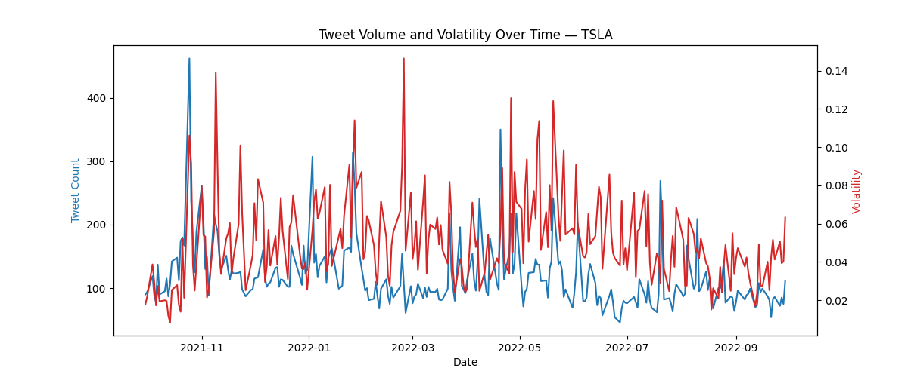

# Market Sentiment Analysis

Using 25 most watched stock tickers on Yahoo Finance spanning 1 year from Q4 2021.
Source: https://www.kaggle.com/datasets/equinxx/stock-tweets-for-sentiment-analysis-and-prediction

## Investigations
[Does the daily volume of tweets about a stock have any correlation with its intraday volatility?](./volatility-correlation/findings.md)

[Does aggregate sentiment from tweets have any correlation or predictive power on market direction?](./market-direction/findings.md)

