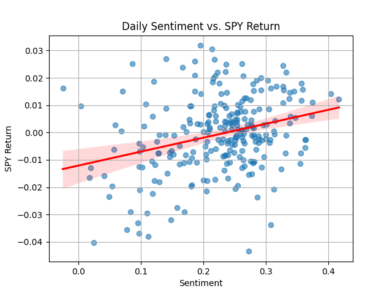
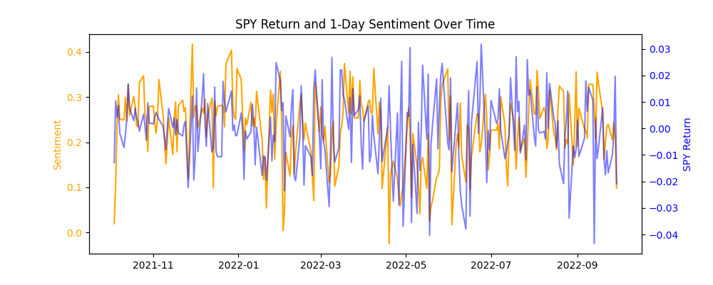
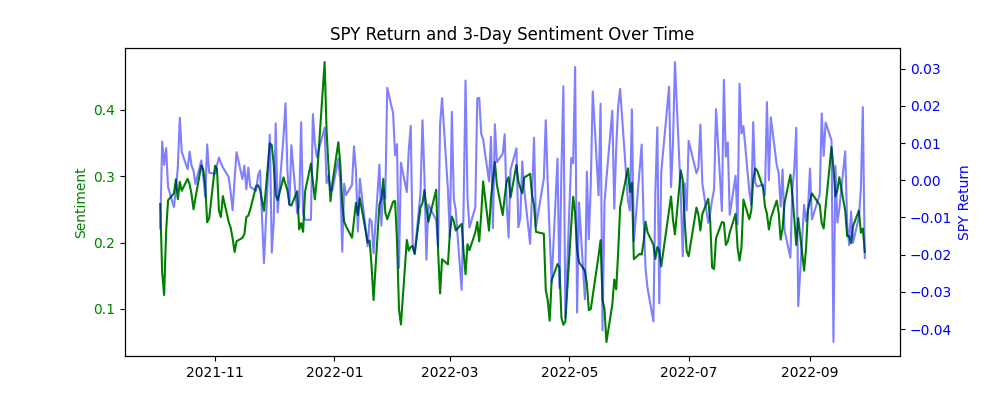
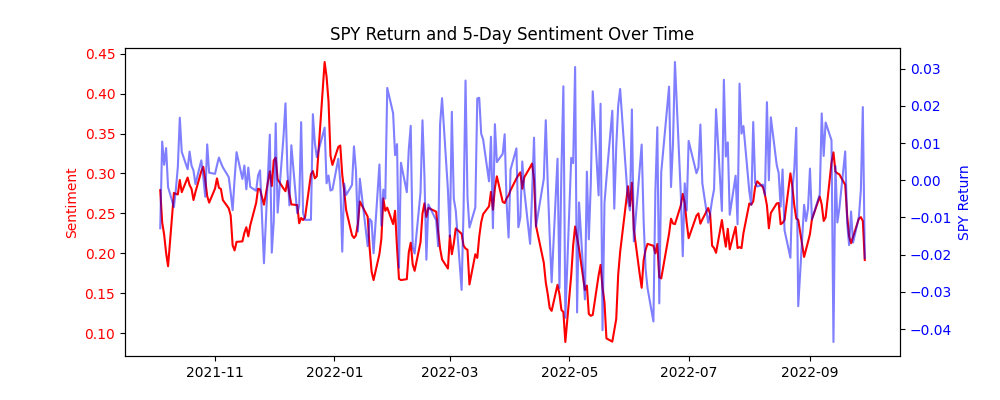

# Aggregate Sentiment as a Predictor of Market Movements

## Goal
Determine if aggregate sentiment from stock related tweets can explain or predict market directions or returns, as measured by SPY.

## Methodology

### 1. Aggregate Sentiment Calculation
Noisy, ticker-level tweet sentiment was transformed into a single daily market sentiment signal.

Each tweet corresponds to an individual stock and holds three separate sentiment scores: positive, negative, and neutral.

A scalar sentiment value was computed per tweet:

$$
\text{net-sentiment}_i = \text{positive}_i - \text{negative}_i
$$

Tweets were then grouped by both date and ticker to compute the average sentiment for each stock on each day. 

$$
\text{sentiment}_ t = \frac{1}{N_ t} \sum_{i=1}^{N_ t} \text{net-sentiment}_ t
$$

where $N_t$ is the number of tweets on day $t$.

Finally, the sentiment measurement was smoothed to explore the persistence of sentiment and reduce volatility.
This was done by computing rolling averages of daily sentiment over 3 and 5 days. These rolling versions will be tested as alternative predictors.

Example: 

$$
\text{sentiment}_ {t}^{(3)} = \frac{1}{3} (\text{sentiment}_ {t} + \text{sentiment}_ {t-1} + \text{sentiment}_ {t-2})
$$

### 2. Market Return Target
1. Using SPY close prices:

$$
\text{return}_ t = \frac{\text{close}_ t - \text{close}_ {t-1}}{\text{close}_ {t-1}}
$$

2. Directional:

$$
y_t = 
\begin{cases}
1 & \text{if } \text{return}_ t > 0 \\
0 & \text{otherwise}
\end{cases}
$$

The first metric is used to test for predicting market return, and then second metric is used to test for predicting market direction.

### 3. Analysis
#### 3.1 Correlation Analysis
Computed Pearson correlation between $\text{sentiment}_ {t}^{(k)}$ for $k \in \{1, 3, 5\}$

This tested the strength of linear association between sentiment and market movement.

#### 3.2 Linear Regression
Modelled SPY return as a function of sentiment:

$$
\text{return}_ {t} = \alpha + \beta \cdot \text{sentiment}_ {t} + \epsilon_t
$$

This model was ran on each sentiment window (1-day, 3-day, 5-day), and the $\beta\$ and p-values were analyzed.

#### 3.3 Logistic Regression
Modelled probability of an upward movement in SPY:

$$
P(y_ t = 1) = \frac{1}{1 + e^{-(\alpha + \beta \cdot \text{sentiment}_ t)}}
$$

Again, ran on each sentiment window.

The $\beta$, classification accuracy, and ROC curve / AUC were evaluated.

## Key Findings
|Sentiment_Window|Correlation_r|Correlation_p|Linear_Beta|Linear_Intercept|Logistic_Beta|Logistic_Intercept|Accuracy|AUC|
|-|-|-|-|-|-|-|-|-|
|Sentiment|0.299356|1.36364e-06|0.0514315|-0.0121737|1.41742|-0.361369|0.545817|0.601944|
|3-day|0.088005|0.165381|0.0202131|-0.00526394|0.291624|-0.115944|0.516|0.528753|
|5-day|0.0903185|0.1545|0.023429|-0.00614271|0.269796|-0.112304|0.512|0.529073|

Daily sentiment shows a weak but statistically significant positive correlation with SPY market returns. (r $\approx$ 0.3, p < 0.001).

Smoothed sentiment using 3-day and 5-day rolling averages showed no meaningful correlation or predictive value.

Linear regression suggests a small posiive relationship between sentiment and return, but the effect size is minimal.

Logistic regression yielded low accuracy ($\approx$ 54.6%) and AUC ($\approx$ 0.6) using daily sentiment, indicating weak directional predictive power.

Overall, raw daily sentiment contains some signal, but smoothing reduces its effectiveness and no strong predictive relationships were found.

